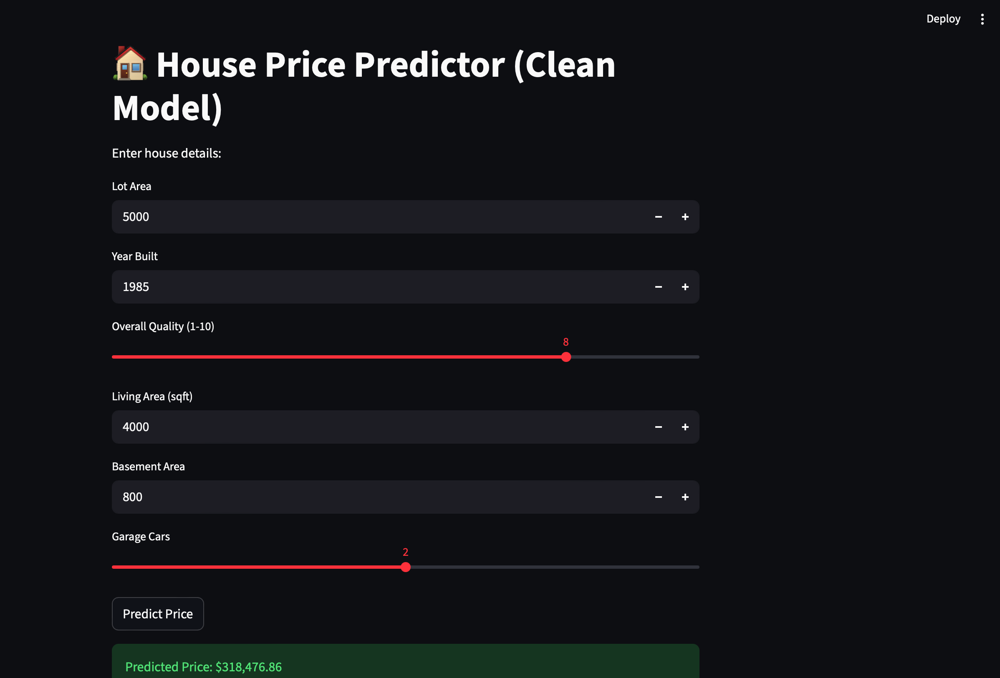

# 🏠 House Price Prediction System (Machine Learning Project)

## 📌 Overview
This project is a machine learning-based web application that predicts house prices based on key property features. It demonstrates an end-to-end ML pipeline including data preprocessing, feature engineering, model training, evaluation, and deployment using Streamlit.

The goal of this project is to build a reliable regression model that can estimate house prices with high accuracy and provide an interactive user interface for real-time predictions.

---

## 🎯 Problem Statement
Real estate pricing is influenced by multiple factors such as location, size, quality, and construction year. The objective is to build a predictive model that can estimate house prices using supervised machine learning techniques.

---

## 📊 Dataset
- Dataset: Ames Housing Dataset
- Features include:
  - Lot Area
  - Year Built
  - Overall Quality
  - Living Area
  - Basement Area
  - Garage Capacity
- Target Variable:
  - SalePrice

---

## ⚙️ Tech Stack
- Python
- Pandas & NumPy
- Scikit-learn
- Streamlit
- Joblib

---

## 🧠 Machine Learning Workflow

1. Data Cleaning & Preprocessing
2. Feature Selection (high-impact features only)
3. Handling missing values using median imputation
4. Model training using Random Forest Regressor
5. Model evaluation using:
   - R² Score
   - Mean Absolute Error (MAE)
   - Root Mean Squared Error (RMSE)
6. Model serialization using Joblib

---

## 📈 Model Performance

- R² Score: ~0.91
- MAE: ~15,000
- RMSE: ~26,000

The model shows strong predictive performance and generalization capability on unseen data.

---

## 🖥️ Web Application

The project includes an interactive web interface built with Streamlit where users can input house features and get instant price predictions.

### Features:
- User-friendly UI
- Real-time prediction
- Clean input controls (sliders & numeric fields)
  
## 📷 Application Preview



## 🌐 Live Demo

👉 Try the deployed app here: 
https://house-price-predictor-22.streamlit.app/

---

📁 Project Structure
```
house-price-predictor/
│
├── app/                 # Streamlit web app
├── data/                # Dataset
├── models/              # Trained model & features
├── notebooks/           # EDA and experiments
├── src/                 # Training pipeline
├── requirements.txt
└── README.md
```
## 🚀 How to Run Locally

### 1. Clone the repository
```bash
git clone https://github.com/hawkthamil/house-price-predictor.git
cd house-price-predictor
```
### 2. Install dependencies
```
pip install -r requirements.txt
```
### 3. Run the app
```
streamlit run app/app.py
```
💡 Key Learnings

* End-to-end ML pipeline development
* Feature selection improves model stability
* Importance of preprocessing consistency
* Deployment using Streamlit
* Real-world regression problem handling

⸻

🔮 Future Improvements

* Hyperparameter tuning (XGBoost / LightGBM)
* Feature importance visualization in UI
* Model comparison dashboard
* Cloud deployment (Streamlit Cloud / AWS)

⸻

👨‍💻 Author

* Name: Thamil
* Field: AI & Machine Learning Student
* Focus: Machine Learning, Data Science, and AI Systems

⸻

⭐ If you like this project

Give it a star on GitHub and feel free to explore improvements!

